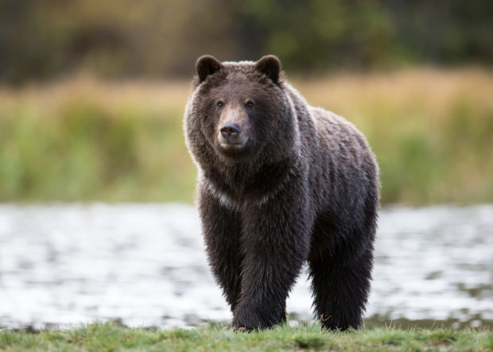
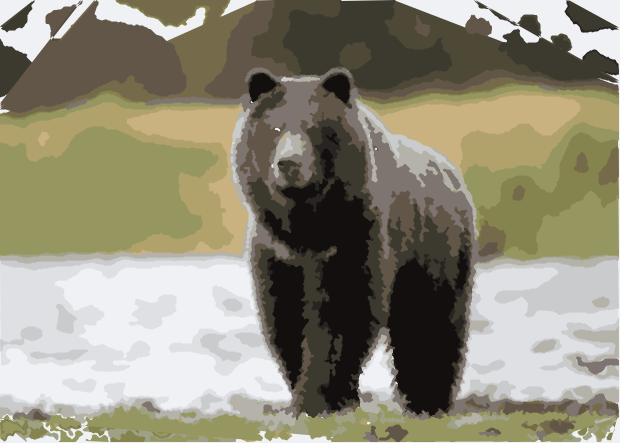
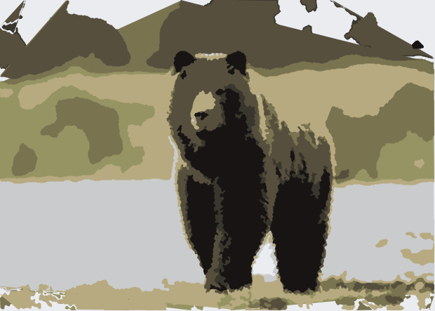
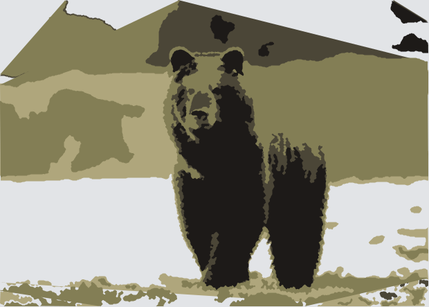

# Image to SVG Converter

A Python script that converts raster images to SVG vectors using color quantization and advanced contour extraction.

## Original JPG


## 16 color SVG


## 8 color SVG


## 5 color SVG


## Features

- Reduces an image to a specified number of colors using K-means clustering
- Creates pure vector SVG with path elements for each color region
- Intelligently handles layering of colors for better visual results
- Offers various options for path simplification and minimum area thresholds
- Smart edge handling with mirrored borders for cleaner contours
- Multiple layering methods: darkness, lightness, area, or hue

## Installation

### Requirements

- Python 3.6 or higher
- pipenv (recommended for dependency management)

### Dependencies

- NumPy
- Pillow (PIL)
- scikit-learn
- scikit-image

### Setup

```bash
# Clone or download this repository
git clone https://github.com/yourusername/image-to-svg.git
cd image-to-svg

# Install dependencies with pipenv
pipenv install numpy pillow scikit-learn scikit-image

# Or use pip directly
pip install numpy pillow scikit-learn scikit-image
```

## Usage

```bash
# Basic usage (with pipenv)
pipenv run python img2svg.py input_image.jpg

# Or activate the environment first
pipenv shell
python img2svg.py input_image.jpg

# Specify output file
python img2svg.py input_image.png -o output.svg

# Change number of colors (e.g., to 8)
python img2svg.py input_image.jpg -c 8

# Choose a layering method
python img2svg.py input_image.jpg -l light_first
```

### Command Line Arguments

- `input_file`: Path to the input image file (required)
- `-o, --output`: Path to the output SVG file (optional, defaults to input filename with .svg extension)
- `-c, --colors`: Number of colors to use (optional, default: 5)
- `-m, --min_area`: Minimum area for shapes in pixels (optional, default: 50)
- `-s, --simplify`: Path simplification factor (optional, default: 2)
- `-l, --layer`: Layering method; options: dark_first, light_first, area, hue (optional, default: dark_first)

## How It Works

1. The script loads the input image using Pillow.
2. It uses K-means clustering to reduce the image to the specified number of colors.
3. For each color region, it:
   - Creates a binary mask
   - Applies morphological operations to clean up the mask
   - Extracts contours from the mask
   - Simplifies paths for smaller file size
   - Creates SVG path elements
4. Colors are layered according to the selected method
5. The most common color is used as the background

## Testing Different Options

A Makefile is included to easily test various combinations of settings:

```bash
# Run all standard tests
make

# Test different color counts
make color_test

# Test different layering methods
make layer_test

# Test different minimum area thresholds
make area_test

# Test different simplification factors
make simplify_test

# Run comprehensive combination tests
make comprehensive_test
```

The test results will be saved in the `assets/chris` directory for comparison.

## License

BSD 3-Clause Revised License

## Notes

- Processing large images may require significant memory and CPU time
- The resulting SVG quality depends on the chosen parameters
- For best results, experiment with different color counts and layering methods
- Bicolor images (2 colors) receive special handling to improve quality
- Edge handling uses mirrored borders for cleaner contours