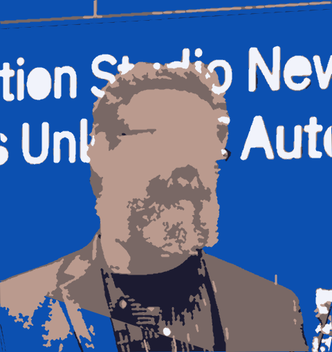

# Image to SVG Converter Results

This document demonstrates the results of the SVG conversion with different parameter settings on our test image.

## Color Variations

### 2 Colors

### 3 Colors

### 4 Colors

### 5 Colors

### 8 Colors

### 12 Colors

As you can see, increasing the number of colors captures more detail in the image, but results in larger file sizes and more complex SVGs. The 2-color version creates a stark, high-contrast image, while the 12-color version preserves more subtle color variations.

## Layering Methods

### Dark First (Default)

### Light First

### By Area

### By Hue

The layering method affects how colors stack in the SVG. "Dark First" places darker colors underneath lighter ones, which often produces a more natural look. "Light First" does the opposite. "Area" stacks larger color regions first, while "Hue" orders by color hue.

## Minimum Area Threshold

### Min Area: 10 pixels

### Min Area: 30 pixels

### Min Area: 50 pixels (Default)

### Min Area: 100 pixels

The minimum area parameter filters out small color patches. A lower value preserves more detail but creates more complex SVGs with more paths. Higher values simplify the image by removing small details.

## Simplification Factor

### Simplify: 1 (No Simplification)

### Simplify: 2 (Default)

### Simplify: 4

### Simplify: 8

The simplification factor controls how aggressively path points are reduced. A factor of 1 keeps all points, creating smoother but larger paths. Higher values reduce file size but may make edges look more jagged.

## Recommendations

For best results:

1. **Colors**: Start with 5-8 colors for a good balance of detail and file size
2. **Layering**: "dark_first" works well for most images but try others for specific effects
3. **Min Area**: 30-50 pixels removes noise while keeping important details
4. **Simplify**: 2-4 provides good path simplification without visible quality loss

Each image may require different settings for optimal results. The Makefile included with the tool allows for easy testing of different parameter combinations.

## Conclusion

The Image to SVG Converter offers flexible parameters to control the vectorization process. By adjusting the number of colors, layering method, minimum area, and simplification factor, you can create SVGs that balance detail, aesthetics, and file size according to your specific needs.